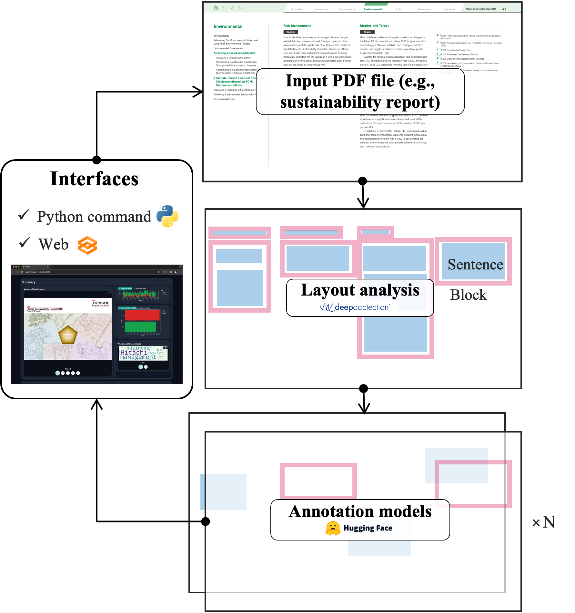
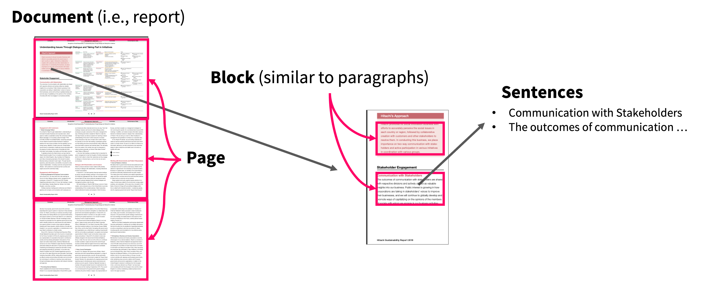
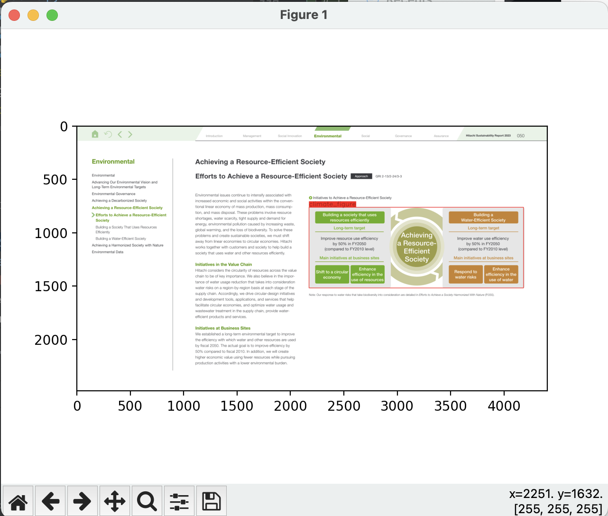
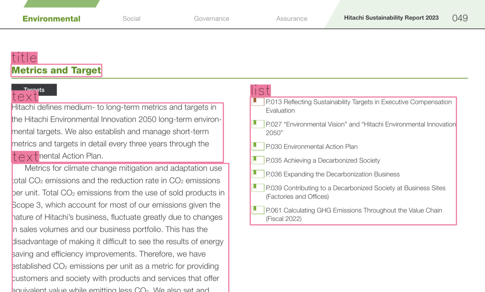

<h2 align="left">
    
    A Unified NLP Analyzer for Corporate Sustainability Reports
</h2>

<p align="left">
    <a href="https://github.com/climate-nlp/reportparse/releases">
        
    </a>
    <a href="https://climate-nlp.github.io/">
        
    </a>
    
</p>

ReportParse is a Python-based tool designed to parse corporate (sustainability) reports. 
It combines document structure analysis with natural language processing (NLP) models to extract sustainability-related information from the reports. 
We also provide easy-to-use web and command interfaces. 
The tool is expected to aid researchers and analysts in evaluating corporate commitment and management of sustainability efforts.

- 🆕 **2024.7**: ```standard_keyword``` annotator is available. This can extract a text that mentions sustainability-related standards (e.g., GRI, SASB, and TCFD).
- 🆕 **2024.7**: ```climate_table``` annotator powered by deepdoctection and ```climate``` annotator is available. This can extract climate-related tables in a report.
- 🆕 **2024.7**: ```climate_figure``` annotator powered by deepdoctection and ```climate``` annotator is available. This can extract climate-related figures in a report.


## Tutorials
- [](https://colab.research.google.com/drive/1SUF7aX62LOUhpp004zn8NItM_tOkCZc4?usp=sharing) Understanding setup and basic example
- [](https://colab.research.google.com/drive/1d9Oe0r3sJpag1e2wMWH6SItuBsQUXFB5?usp=sharing) Understanding setup and basic example (install without root permission for deepdoctection).
- [](https://colab.research.google.com/drive/1c82lWdv7xJkM1ef1jnI3Q9uyJVIsDPLY?usp=sharing) Analyzing sentiment of corporate sustainability reports


## Why should I use ReportParse?

- 💡ReportParse will reduce your workload to analyze corporate sustainability activities for your research. We know implementing the PDF text extraction and NLP model utilization for this purpose is painstaking. ReportParse will take these things instead of you.
- 💡ReportParse will be useful to test the robustness of your research. To improve the analytical robustness, you may want to try similar but different model or processing variants. ReportParse can easility change the PDF analysis method and NLP model. 
- 💡ReportParse will increase reproducibility of your analysis. ReportParse uses open sourced tools and methods. This will make it easier for other researchers to replicate your analysis.

You should use ReportParse for

- Investigating the number of environmental claims in a corporate report.
- Extracting claims related to GHG emission reduction targets in a corporate report.
- Investigating ESG topics included in a corporate report.

You should NOT use ReportParse for

- Fine-grained document structure analysis.
- Requiring 100% accuracy. (In fact, you will face a lot of noise produced by layout analysis and NLP models.)
- Automating some critical work because ReportParse usually contains noise and errors stem from the analysis.


## How does ReportParse work?

<p align="center">
  
</p>

We provide the core engine and interfaces.
Conceptually, the core engine of ReportParse was inspired by [PaperMage](https://github.com/allenai/papermage), which can extract information from scientific papers.
However, different from PaperMage, ReportParse does not consider any specific document structure because corporates publish reports in very different structure.
We support existing NLP models related to climate and sustainability domain.
For interfaces, we provide the web (based on Gradio) and command line interfaces.
Read our IJCAI 2024 demonstration paper "ReportParse: A Unified NLP Tool for Extracting Document Structure and Semantics of Corporate Sustainability Reporting" for technical detail.

### Understanding document structure, reader, and annotator

ReportParse can extract document structure from a reports.
The following figure shows the important document structure levels (page, block, and sentences) represented in ReportParse.

<p align="center">
  
</p>

By using [deepdoctection](https://github.com/deepdoctection/deepdoctection), the _reader_ can analyze the document structure. 
Then, an _annotator_ of ReportParse annotates labels for each structure level (i.e., page, block, or sentence) by using cutting-edge language models.
We integrate useful and valuable third-party models for the annotators.
For example by using ```environmental_claim``` (Stammbach et al., see [annotators](#annotators)) annotator, you can extract sentences that are related to environmental claims.
You can easily change the reader and annotator, or you can create your own reader or annotator.

See current supported [readers](#readers) and [annotators](#annotators).

### Citation

Please cite the following paper if you use our tool in your work.

```bibtex
@inproceedings{morio-etal-2024-reportparse,
  title     = {{R}eport{P}arse: A Unified NLP Tool for Extracting Document Structure and Semantics of Corporate Sustainability Reporting},
  author    = {Morio, Gaku and In, Soh Young and Yoon, Jungah and Rowlands, Harri and Manning, Christopher D.},
  booktitle = {Proceedings of the Thirty-Third International Joint Conference on Artificial Intelligence, {IJCAI-24}},
  publisher = {International Joint Conferences on Artificial Intelligence Organization},
  pages     = {to appear},
  year      = {2024},
  note      = {Demos},
}
```

### References

Our project is inspired by or related to following wonderful projects. If you are interested in, please read our paper and the following papers.
- [PaperMage](https://aclanthology.org/2023.emnlp-demo.45/): A standardized tool to analyze academic papers. The technical concept of our project is inspired by PaperMage.
- [CHATREPORT](https://aclanthology.org/2023.emnlp-demo.3/): A first tooled analyzer for sustainability reports. If you do not need the document layout analysis and want to use LLMs, this tool would be useful. For more details on the differences between our tool and this, see our paper.


## Quick setup

### Environment

We highly recommend you to prepare the Python environment only for ReportParse because our tool depends on complicated external package versions.
At this time, we officially support the following version.

- Python 3.8.16

### Clone the project

```bash
git clone https://github.com/climate-nlp/reportparse
cd reportparse
```

### Install dependencies

Run the following commands to install required packages.

```bash
pip install pip==23.3.1 setuptools==59.5.0 cython==3.0.6 wheel==0.42.0
pip install "deepdoctection[pt]==0.26" --no-deps
pip install -r requirements.txt
pip install git+https://github.com/facebookresearch/detectron2.git@ff53992b1985b63bd3262b5a36167098e3dada02 --no-build-isolation

python -m spacy download en_core_web_sm

# Make sure that the torch and torchvision version depend on your Python version
pip install torch==1.10.1 torchvision==0.11.2
# If you use CUDA, for example:
#pip install torch==1.10.1+cu111 torchvision==0.11.2+cu111 -f https://download.pytorch.org/whl/torch_stable.html
```
**IMPORTANT: To use deepdoctection, you need to install external packages of poppler, tesseract, leptonica, and qpdf.**

```bash
sudo apt-get update
sudo apt install -y libtool poppler-utils python3-opencv tesseract-ocr qpdf
```

If you want to install the above libs without root permissions, please refer to [auto_install_deepdoctection_deps.sh](auto_install_deepdoctection_deps.sh) and example notebook [](https://colab.research.google.com/drive/1d9Oe0r3sJpag1e2wMWH6SItuBsQUXFB5?usp=sharing).

After installing all of the above, you can check if the required packages are installed.

```bash
python -m reportparse.show_version
````


## Quick example 1 (extracting environmental claims and sentiments from a sustainability report)

The following shows examples of analyzing example PDF file at ```reportparse/asset/example.pdf```. 
For example, we use ```pymupdf``` as the [reader](#readers) and ```environmental_claim``` and ```sst2``` (provided by DistilBERT community) as the [annotators](#annotators).

### By the python command line tool

```bash
python -m reportparse.main \
  -i ./reportparse/asset/example.pdf \
  -o ./results \
  --input_type "pdf" \
  --overwrite_strategy "no" \
  --reader "pymupdf" \
  --annotators "environmental_claim" "sst2"
 
# To use layout analysis,
python -m reportparse.main \
  -i ./reportparse/asset/example.pdf \
  -o ./results \
  --input_type "pdf" \
  --overwrite_strategy "no" \
  --reader "deepdoctection" \
  --annotators "environmental_claim" "sst2"
```

### By the python code

```python
# Save this file as example_code.py under the root directory of the reportparse project

import os
from reportparse.reader.base import BaseReader
from reportparse.annotator.base import BaseAnnotator

reader = BaseReader.by_name('pymupdf')()
# To use layout analysis,
# reader = BaseReader.by_name('deepdoctection')()
document = reader.read(input_path='./reportparse/asset/example.pdf')

document = BaseAnnotator.by_name("environmental_claim")().annotate(document=document)
document = BaseAnnotator.by_name("sst2")().annotate(document=document)

os.makedirs('./results', exist_ok=True)

# Save the full data as a JSON file
document.save('./results/example.pdf.json')
# Save the easy-to-use dataset as a CSV file
document.to_dataframe(level='sentence').to_csv('./results/example.pdf.sentence-level-dataset.csv')
```

```bash
python -m example_code
```

### How do the results look like?

- The output JSON file would be look like [example.pdf.json](reportparse%2Fasset%2Fexample_results%2Fexample.pdf.json). If you want to investigate full document structure, this file would be informative.
- The output CSV file would be look like [example.pdf.sentence-level-dataset.csv](reportparse%2Fasset%2Fexample_results%2Fexample.pdf.sentence-level-dataset.csv). This file is useful to count labels included in a document.
  - If you would like to refer to different annotation levels such as block or page, you can see [example.pdf.block-level-dataset.csv](reportparse%2Fasset%2Fexample_results%2Fexample.pdf.block-level-dataset.csv) or [example.pdf.page-level-dataset.csv](reportparse%2Fasset%2Fexample_results%2Fexample.pdf.page-level-dataset.csv).

### Example data analysis using the output file of ReportParse

Extracting environmental claims and sentiments, and counting them.

```python
import pandas as pd

# Read the CSV dataset file
df = pd.read_csv('reportparse/asset/example_results/example.pdf.sentence-level-dataset.csv')

# ----------------------------------------
# Extract and count environmental claims
# ----------------------------------------

# Get environmental claim sentences
df_environment = df[df['environmental_claim'] == 'yes']
# Remove "too short" sentences
df_environment = df_environment[(df_environment['sentence_text'].str.split().str.len() > 20)]

# Show some example text
print(df_environment[:5]['sentence_text'])
# Results -->
# 10    Hitachi identifies, evaluates, and manages cli...
# 18    Therefore, we have established COz emissions p...
# 19    We also set and manage a metric for avoided em...
# 20    We continue to reduce COz emissions generated ...
# 22    In addition, in April 2021, Hitachi, Ltd. intr...
# Name: sentence_text, dtype: object

# Show some example texts
print('The number of total sentences:', len(df))
# Result --> The number of total sentences: 158
print('The number of environmental claim sentences:', len(df_environment))
# Result --> The number of environmental claim sentences: 36
print('Environmental claim ratio [%]:', 100 * len(df_environment) / len(df))
# Result --> Environmental claim ratio [%]: 22.78481012658228

# ----------------------------------------
# Extract and count positive/negative sentiments for environmental claims
# ----------------------------------------

# Get environmental claim sentences
df_environment_pos = df_environment[df_environment['sst2'] == 'POSITIVE']
df_environment_neg = df_environment[df_environment['sst2'] == 'NEGATIVE']

# Show some example text
print(df_environment_pos[:2]['sentence_text'])
# 10    Hitachi identifies, evaluates, and manages cli...
# 18    Therefore, we have established COz emissions p...
# Name: sentence_text, dtype: object
print(df_environment_neg[:2]['sentence_text'])
# Results -->
# 30    These problems involve resource shortages, wat...
# 36    We also believe in the impor- tance of water u...
# Name: sentence_text, dtype: object

# Note: It seems that negative claims are more on risk-related descriptions

print('The number of "positive" environmental claim sentences:', len(df_environment_pos))
# Result --> The number of "positive" environmental claim sentences: 20
print('The number of "negative" environmental claim sentences:', len(df_environment_neg))
# Result --> The number of "positive" environmental claim sentences: 16
```


## Quick example 2 (extracting mentions for sustainability-related standards)

The following extracts mentions related to standards from ```reportparse/asset/example.pdf```, by utilizing keyword search. 
We use ```pymupdf``` as the [reader](#readers) and ```standard_keyword``` as the [annotator](#annotators).

```python
from reportparse.reader.base import BaseReader
from reportparse.annotator.base import BaseAnnotator

reader = BaseReader.by_name('pymupdf')()
document = reader.read(input_path='./reportparse/asset/example.pdf')
document = BaseAnnotator.by_name("standard_keyword")().annotate(document=document)

df = document.to_dataframe(level='sentence')
print(df.columns)
# Result --> Index(['page_id', 'block_id', 'sentence_id', 'sentence_bbox', 'sentence_span',
#       'sentence_text', 'standard_keyword-TCFD', 'standard_keyword-TCFD-score',
#       'standard_keyword-GRI', 'standard_keyword-GRI-score',
#       'standard_keyword-SASB', 'standard_keyword-SASB-score',
#       'standard_keyword-UN Global Compact',
#       'standard_keyword-UN Global Compact-score', 'standard_keyword-SDGs',
#       'standard_keyword-SDGs-score', 'standard_keyword-ISO-14001',
#       'standard_keyword-ISO-14001-score', 'standard_keyword-ISO-14040',
#       'standard_keyword-ISO-14040-score', 'standard_keyword-ISO-45001',
#       'standard_keyword-ISO-45001-score', 'standard_keyword-EPA',
#       'standard_keyword-EPA-score', 'standard_keyword-CDP',
#       'standard_keyword-CDP-score', 'standard_keyword-EU REACH',
#       'standard_keyword-EU REACH-score', 'standard_keyword-ICH',
#       'standard_keyword-ICH-score', 'standard_keyword-WEF',
#       'standard_keyword-WEF-score', 'standard_keyword-EcoVadis',
#       'standard_keyword-EcoVadis-score'],
#      dtype='object')

# Let's see how GRI is mentioned in the report.
print(df[df['standard_keyword-GRI'] == 'yes']['sentence_text'].to_list())
# Result --> ['Efforts to Achieve a Resource-Efficient Society Approach GRI 2-13/2-24/3-3 Achieving a Resource-Efficient...
```


## Quick example 3 (extracting tables related to climate)

The following extracts tables related to climate ```reportparse/asset/example.pdf```.
We use ```deepdoctection``` as the [reader](#readers) and ```climate_table``` as the [annotator](#annotators).
**Note that table analyses are only supported by ```deepdoctection```.**

```python
import pandas as pd
pd.set_option('display.max_rows', 20)
pd.set_option('display.max_columns', 20)
pd.set_option('display.width', 500)
from reportparse.reader.base import BaseReader
from reportparse.annotator.base import BaseAnnotator

reader = BaseReader.by_name('deepdoctection')()
document = reader.read(input_path='./reportparse/asset/example.pdf')
document = BaseAnnotator.by_name("climate_table")().annotate(document=document)

df = document.to_dataframe(level='table')
print(df.columns)
# Result --> Index(['page_id', 'table_id', 'table_bbox', 'table_html', 'table_text',
#       'table_block_ids', 'climate_table', 'climate_table-score'],
#      dtype='object')

# Let's see extracted tables
for table_html in df[df['climate_table'] == 'yes']['table_html'].to_list():
    print(pd.read_html(table_html))
    print('\n\n')
# Result --> [                                                   0
# 0                      From base year 16:. reduction
# 1                      From base year 16:. reduction
# 2  100% Target: 14% 84,, Amount generated Amount ...
# 3  100% Target: 14% 84,, Amount generated Amount ...
# 4  100% Target: 14% 84,, Amount generated Amount ...
# 5                          FY2010 FY2022 (base year)]

# Unfortunately, because the tables of the report are complicatedly designed, the extracted tables contain a lot of errors produced by layout analysis. 
```


## Quick example 4 (extracting figures related to climate)

The following extracts figures related to climate ```reportparse/asset/example.pdf```.
We use ```deepdoctection``` as the [reader](#readers) and ```climate_figure``` as the [annotator](#annotators).
**Note that figure analyses are only supported by ```deepdoctection```.**

```python
import matplotlib.pyplot as plt
from reportparse.reader.base import BaseReader
from reportparse.annotator.base import BaseAnnotator
from reportparse.util.helper import draw_boxes

reader = BaseReader.by_name('deepdoctection')()
document = reader.read(input_path='./reportparse/asset/example.pdf')
document = BaseAnnotator.by_name("climate_figure")().annotate(document=document)

df = document.to_dataframe(level='figure')
print(df.columns)
# Result --> Index(['page_id', 'figure_id', 'figure_bbox', 'figure_text', 'climate_figure',
#       'climate_figure-score'],
#       dtype='object')

# Let's see the bounding boxes of the figures
for _, climate_figure in df[df['climate_figure'] == 'yes'].iterrows():
    print('Found figure at', climate_figure['page_id'], climate_figure['figure_bbox'])

# Let's see the figures extracted
for _, climate_figure in df[df['climate_figure'] == 'yes'].iterrows():
    page = document.find_page_by_id(page_id=climate_figure['page_id'])
    img = page.image
    img = draw_boxes(
        np_image=img,
        boxes=[climate_figure['figure_bbox']],
        category_names_list=['climate_figure'],
        category_to_color={'climate_figure': (255, 20, 20)},
        font_scale=2,
        rectangle_thickness=4,
    )
    figure_plot = plt.imshow(img)
    plt.show()
```

An example of the detected figure (shown in the red bounding box):

<p align="center">
  
</p>


## Quick example 5 (extracting layouts)

The following extracts layout information of the input document ```reportparse/asset/example.pdf```.
**Note that the layout analysis is only supported by ```deepdoctection```.**

The layout is analyzed in the block-level. 
It is useful to filter out unnecessary information from your analysis.
The type contains:
- ```text```: The ordinal text block (similar to paragraph).
- ```list```: The text block recognized as a list instance.
- ```title```: The titles. We do not consider any title-levels such as subtitles.
- ```cell```: The text block recognized as a cell in tables.

<p align="center">
  
</p>

Here's an example to get layout-specific blocks.

```python
import pandas as pd
pd.set_option('display.max_rows', 20)
pd.set_option('display.max_columns', 20)
pd.set_option('display.width', 500)
from reportparse.reader.base import BaseReader

reader = BaseReader.by_name('deepdoctection')()
document = reader.read(input_path='./reportparse/asset/example.pdf')

df = document.to_dataframe(level='block')
print(df.columns)
# Result --> Index(['page_id', 'block_id', 'block_layout_type', 'block_bbox', 'block_text'], dtype='object')

# Extracting ordinal text blocks
title_blocks = df[df['block_layout_type'] == 'text']
for _, block in title_blocks.iterrows():
    print(f"block_id: {block['block_id']}, bbox: {block['block_bbox']}, text: {block['block_text']}")
# Result --> block_id: c85c7b64-a85d-3429-8e2d-7071860e5791, bbox: (141.0, 444.0, 358.0, 486.0), text: Environmental
#            block_id: e52fa848-025b-3538-af8e-48d17bdc18e9, bbox: (138.0, 508.0, 755.0, 597.0), text: Advancing Our Environmental Vision and Long-Term Environmental Targets
# ...

# Extracting titles
title_blocks = df[df['block_layout_type'] == 'title']
for _, block in title_blocks.iterrows():
    print(f"block_id: {block['block_id']}, bbox: {block['block_bbox']}, text: {block['block_text']}")
# Result --> block_id: f222c053-7f0e-325f-beae-2898e75ef169, bbox: (140.0, 291.0, 544.0, 370.0), text: Environmental
#            block_id: 4b351da4-9026-3e3b-ba68-89fd2be8f6da, bbox: (141.0, 682.0, 725.0, 727.0), text: Achieving a Decarbonized Society
# ...

# Extracting lists
list_blocks = df[df['block_layout_type'] == 'list']
for _, block in list_blocks.iterrows():
    print(f"block_id: {block['block_id']}, bbox: {block['block_bbox']}, text: {block['block_text']}")
# Result --> block_id: b6912d9e-8db5-303e-891a-c2090e95202f, bbox: (3229.0, 443.0, 4141.0, 1009.0), text: MR }P013 Reflecting Sustainability Targets in Executive Compensation Evaluation R|P.027 “Environmental Vision” and “Hitachi Environmental Innovation 2050” K|P.030 Environmental Action Plan N |P035 Achieving a Decarbonized Society N |P036 Expanding the Decarbonization Business KX |P.039 Contributing to a Decarbonized Society at Business Sites (Factories and Offices) RN |Po61 Calculating GHG Emissions Throughout the Value Chain (Fiscal 2022)
# ...

# Extracting table cells
cell_blocks = df[df['block_layout_type'] == 'cell']
for _, block in cell_blocks.iterrows():
    print(f"block_id: {block['block_id']}, bbox: {block['block_bbox']}, text: {block['block_text']}")
# Result --> block_id: 3680f920-d4c2-3ea8-8fab-414ca5e7a857, bbox: (2549.3164672851562, 697.0629470348358, 2843.3768920898438, 964.8352966308594), text: From base year 16:. reduction
#            block_id: e5cce930-8ff1-3724-b84f-35e5a39c17df, bbox: (2205.4156799316406, 970.4532470703125, 3113.1996459960938, 1207.3731689453125), text: 100% Target: 14% 84,, Amount generated Amount generated __ =p» __ ~ = Activity amount”
# ...


# Visualize layouts of the first page
document.pages[0].show()
```


## Web interfaces

We provide two types of Gradio-based interfaces to better understand the output results.

The following is the example to launch a demo server. 
You can upload your own PDF file to analyze it. 

```bash
python -m reportparse.demo \
  --server_name 0.0.0.0 \
  --server_port 60233
```

The following is the example to launch a visualization server. 
You can only select already analyzed files (i.e., JSON output files). 

```bash
python -m reportparse.viewer \
  --pdf_dir ./reportparse/asset \
  --json_dir ./results \
  --server_name 0.0.0.0 \
  --server_port 60233
```


## Other tips

### Options of the command line tool

When running ```python -m reportparse.main```, you can use following options.

| Option name          | Type                                                     | Description                                                                                                                                                                                                                                                                                                                                                                                                      |
|----------------------|----------------------------------------------------------|------------------------------------------------------------------------------------------------------------------------------------------------------------------------------------------------------------------------------------------------------------------------------------------------------------------------------------------------------------------------------------------------------------------|
| -i, --input          | str                                                      | The input file or directory path. If you specify a directory, we will automatically find all files under the directory. You can specify either PDF files or JSON file (i.e., the output data file of ReportParse). If you would like to input json files, you have to change the ```--input_type``` option below.                                                                                                |
| -o, --output_dir     | str                                                      | The output directory path.                                                                                                                                                                                                                                                                                                                                                                                       |
| --input_type         | str ("pdf" or "json")                                    | The input file type. The default is "pdf". If you specify "pdf", we will consider the input file as a PDF file. If "json" is specified, we consider the input file as the output file of ReportParse where we will load data only from it.                                                                                                                                                                       |
| --reader             | str ("pymupdf" or "deepdoctection")                      | The name of the PDF layout / text extraction method. The default is "pymupdf". We currently support "pymupdf" or "deepdoctection". See more detail at [Reader types](#readers).                                                                                                                                                                                                                                  |
| --annotators         | List of str                                              | The annotation methods to apply. The annotator assigns each element (sentence, block, or page) with a label. See more detail at [Annotator types](#annotators). If you do not specify anything here, the reader will only be applied (i.e., only document structure analysis will be conducted).                                                                                                                 |
| --max_pages          | int                                                      | The number of max pages to load by the reader. We read all pages by default.                                                                                                                                                                                                                                                                                                                                     |
| --skip_pages         | List of int                                              | The pages to skip. The default is None. Zero-indexed. For example, if you would like to skip the first cover page, you can specify 0.                                                                                                                                                                                                                                                                            |
| --skip_load_image    | bool (0 or 1)                                            | Whether to skip loading the image of pages. The default is 0 (False).                                                                                                                                                                                                                                                                                                                                            |
| --overwrite_strategy | str ("no", "all", "annotator-add", or "annotator-clear") | Whether to overwrite the output file if it exists. The default is "no". "no" will not overwrite the output file. "all" will replace the existing output file with the completely new one. "annotator-clear" will use existing "reader" results but does not use old annotator results. "annotator-add" will use existing "reader" results and overwrite the annotator results only for the specified annotators. |

We also provide annotator specific optional arguments. Please refer to them by running ```python -m reportparse.main --help```.

<h3 id="readers">Readers</h4>

We currently support following readers.
Note that it is impossible to provide 100% accurate reader, given the diverse nature of corporate report structure.
Please use the reader that best suits your purpose.
If you would like to add more, please contribute! 

| Reader name          | Description                                                                                                                                                                                                                                                                                   | Pro                                                                                 | Con                                                                                                             |
|----------------------|-----------------------------------------------------------------------------------------------------------------------------------------------------------------------------------------------------------------------------------------------------------------------------------------------|-------------------------------------------------------------------------------------|-----------------------------------------------------------------------------------------------------------------|
| ```pymupdf```        | We use Fitz of [PyMuPDF](https://pymupdf.readthedocs.io/en/latest/) to extract document structure and text from a PDF file. Note that it does no use layout analysis. We only use sentence tokenization by SpaCy. **This means the block and the sentence is exactly the same meaning here.** | <ul><li>Fast</li><li>No OCR errors</li><li>Well tested</li></ul>                    | <ul><li>No layout analysis</li><li>No text extraction for image-based PDF files</li><li>Low precision</li></ul> |
| ```deepdoctection``` | We use [deepdoctection](https://github.com/deepdoctection/deepdoctection) to analyze document structure and extract text by OCR engines. The block type includes "title", "text", "list", and "cell".                                                                                         | <ul><li>Layout analysis</li><li>Text extraction for image-based PDF files</li></ul> | <ul><li>Slow</li><li>OCR errors</li><li>Complicated installation</li><li>Low recall</li></ul>                   |


<h3 id="annotators">Annotators</h4>

This project integrates a lot of valuable third-party models for the annotators.
We currently support following annotators (note that usually the annotator integration is done by us and the original provider is not involved.)
**Do not forget to credit the original work if you use the following annotators.**
Note that many models are not trained on the sustainability report domain, so please be in mind that the output results contain many errors.
If you would like to add more, please contribute! 

| Annotator name                      | Credit                      | Reference                                                                                                                                                             | License                                                                                                | Description                                                                                                                                                  | Default level |
|-------------------------------------|:----------------------------|-----------------------------------------------------------------------------------------------------------------------------------------------------------------------|--------------------------------------------------------------------------------------------------------|--------------------------------------------------------------------------------------------------------------------------------------------------------------|---------------|
| ```climate```                       | Bingler et al.              | [Huggingface](https://huggingface.co/climatebert/distilroberta-base-climate-detector), [Paper](https://www.sciencedirect.com/science/article/pii/S0378426624001080)   | [Apache 2.0](https://huggingface.co/datasets/choosealicense/licenses/blob/main/markdown/apache-2.0.md) | Classify text into climate-related or not.                                                                                                                   | block         |
| ```climate_commitment```            | Bingler et al.              | [Huggingface](https://huggingface.co/climatebert/distilroberta-base-climate-commitment), [Paper](https://www.sciencedirect.com/science/article/pii/S0378426624001080) | [Apache 2.0](https://huggingface.co/datasets/choosealicense/licenses/blob/main/markdown/apache-2.0.md) | Classify climate-related text into "climate commitments and actions" or not.                                                                                 | block         |
| ```climate_sentiment```             | Bingler et al.              | [Huggingface](https://huggingface.co/climatebert/distilroberta-base-climate-sentiment), [Paper](https://www.sciencedirect.com/science/article/pii/S0378426624001080)  | [Apache 2.0](https://huggingface.co/datasets/choosealicense/licenses/blob/main/markdown/apache-2.0.md) | Classify climate-related text into climate-related "sentiment classes", either opportunity, neutral, or risk.                                                | block         |
| ```environmental_claim```           | Stammbach et al.            | [Huggingface](https://huggingface.co/climatebert/environmental-claims), [Paper](https://aclanthology.org/2023.acl-short.91/)                                          | [Apache 2.0](https://huggingface.co/datasets/choosealicense/licenses/blob/main/markdown/apache-2.0.md) | Classify text into environmental claim or not. The model is trained on the EnvironmentalClaims dataset.                                                      | sentence      |
| ```standard_keyword```              | ReportParse                 |                                                                                                                                                                       | Apache 2.0                                                                                             | Detect keywords related to standards (TCFD, GRI, SASB, UN Global Compact, SDGs, ISO-14001, ISO-14040, ISO-45001, EPA, CDP, EU REACH, ICH, WEF, and EcoVadis) | sentence      |
| ```climate_table```                 | ReportParse, Bingler et al. | We use```climate``` to detect climate-related pages.                                                                                                                  | [Apache 2.0](https://huggingface.co/datasets/choosealicense/licenses/blob/main/markdown/apache-2.0.md) | Classify tables into climate-related or not. If a table is in a climate-related page, then the table is heuristically classified into climate-related.       | table         |
| ```climate_figure```                | ReportParse, Bingler et al. | We use```climate``` to detect climate-related pages.                                                                                                                  | [Apache 2.0](https://huggingface.co/datasets/choosealicense/licenses/blob/main/markdown/apache-2.0.md) | Classify figures into climate-related or not. If a figure is in a climate-related page, then the figure is heuristically classified into climate-related.    | figure        |
| ```esg_bert```                      | Mukherjee et al.            | [Huggingface](https://huggingface.co/nbroad/ESG-BERT), [Blog](https://towardsdatascience.com/nlp-meets-sustainable-investing-d0542b3c264b)                            | [Apache 2.0 (Github)](https://github.com/mukut03/ESG-BERT?tab=Apache-2.0-1-ov-file#readme)             | Classify text into 26 ESG-related topics. The full list of labels can be found [here]().                                                                     | sentence      |
| ```netzero_reduction```             | Schimanski et al.           | [Huggingface](https://huggingface.co/climatebert/netzero-reduction), [Paper](https://aclanthology.org/2023.emnlp-main.975/)                                           | [Apache 2.0](https://huggingface.co/datasets/choosealicense/licenses/blob/main/markdown/apache-2.0.md) | Classify climate-related text into net-zero target, reduction target, or no-target.                                                                          | block         |
| ```sst2```                          | DistilBERT community        | [Huggingface](https://huggingface.co/distilbert/distilbert-base-uncased-finetuned-sst-2-english), [Related paper](https://www.mdpi.com/2076-3417/12/11/5614)          | [Apache 2.0](https://huggingface.co/datasets/choosealicense/licenses/blob/main/markdown/apache-2.0.md) | Classify text into positive or negative.                                                                                                                     | sentence      |
| ```transition_physical_renewable``` | Deng et al.                 | [Huggingface](https://huggingface.co/climatebert/transition-physical), [Paper](https://papers.ssrn.com/sol3/papers.cfm?abstract_id=4080181)                           | [Apache 2.0](https://huggingface.co/datasets/choosealicense/licenses/blob/main/markdown/apache-2.0.md) | Classify text into transition risk exposure, physical risk exposure, or transition risk exposure related to renewable energy.                                | block         |


### Using custom huggingface models

Want to use some of your favorite huggingface models? 
You can use special annotator of ```custom_huggingface```.
For example, you can use [FinanceInc/auditor_sentiment_finetuned](https://huggingface.co/FinanceInc/auditor_sentiment_finetuned) as the annotator as follows.

```bash
python -m reportparse.main \
  -i reportparse/asset/example.pdf \
  -o ./results \
  --reader "pymupdf" \
  --annotators "custom_huggingface" \
  --custom_huggingface_annotator_name "auditor_sentiment" \
  --custom_huggingface_model_name_or_path "FinanceInc/auditor_sentiment_finetuned" \
  --custom_huggingface_level "block"
```


### Custom keyword analysis

You can use special annotator of ```keyword``` to extract texts that contain specific keywords.

```bash
python -m reportparse.main \
  -i reportparse/asset/example.pdf \
  -o ./results \
  --reader "pymupdf" \
  --annotators "keyword" \
  --keyword_search_text "\\bcircular economy\\b" \
  --keyword_annotator_name 'keyword-circular-economy' \
  --keyword_target_layouts "text" "list" "cell" \
  --keyword_level "sentence"
```


### Loading a document instance from the parsed JSON file

```python
from reportparse.structure.document import Document

document = Document.from_json_file('./reportparse/asset/example_results/example.pdf.json')
df = document.to_dataframe(level='sentence')
print(df)
# Result --> page_id                              block_id  ...      sst2 sst2-score
# 0    page_idx_0  f222c053-7f0e-325f-beae-2898e75ef169  ...       NaN        NaN
# 1    page_idx_0  c85c7b64-a85d-3429-8e2d-7071860e5791  ...  POSITIVE   0.998334
# 2    page_idx_0  e52fa848-025b-3538-af8e-48d17bdc18e9  ...  POSITIVE   0.999226
# ...
```

### Overwrite or add annotations on the parsed JSON file

You may want to use existing parsed data instead of getting all the results from scratch because the deepdoctection reader takes a lot of time to parse.
The following shows an example on how to overwrite or add annotators on top of the existing parsed data.

```bash
# Overwrite
python -m reportparse.main \
  -i reportparse/asset/example.pdf \
  -o ./results \
  --reader "deepdoctection" \
  --annotators "sst2" \
  --overwrite_strategy "annotator-clear"
 
# Add
python -m reportparse.main \
  -i reportparse/asset/example.pdf \
  -o ./results \
  --reader "pymupdf" \
  --annotators "sst2" \
  --overwrite_strategy "annotator-add"
```


## FAQs

- I have faced errors when installing ReportParse.
  - We provide installation examples on Google Colab notebooks. Unless you face erros on the notebooks, the problem would be on your own environment. We do not consider any inquiries in this case.
- Can we use it for any PDF files other than sustainability reports?
  - Technically yes. However, we do not actively support genral reports or other PDF files.
- We want to extract more fine-grained document structure for my own report.
  - Unfortunately, we do not want to support _any_ documents. Reports are usually unstructured documents represented in a PDF file, and it is impossible to support all of them. Instead, we want to implement more general methods that can apply for various type of reports. 
- Is ReportParse reliable enough?
  - We plan to add some test codes to ensure the functional correctness. Please keep in mind that our tool may contain any bugs. Do not hesitate to point out these bugs if you find.


## Future work

- LLM support
- Span-level annotation


## License

See LICENSE file for the license of this project. Note that some codes of this project include third-party codes.
Be careful of licenses of the third-party codes and models.

- [helper.py](reportparse%2Futil%2Fhelper.py) includes a modified method from deepdoctection

